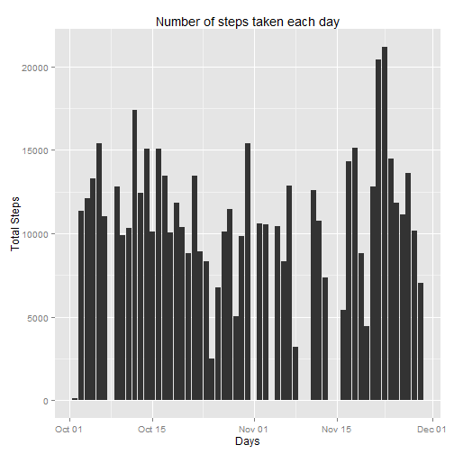
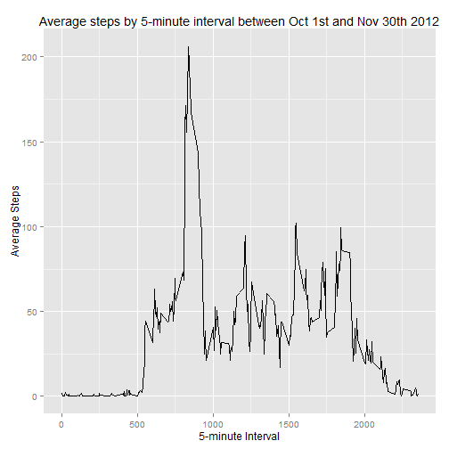
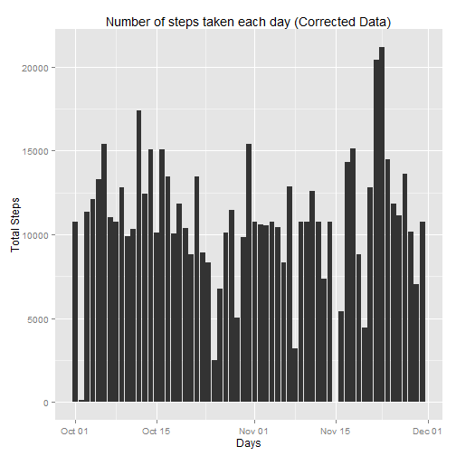
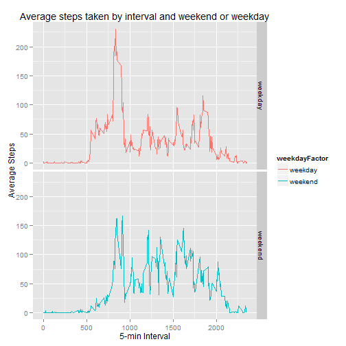

Reproducible Research: Peer Assessment 1
==============================================

Author: **Cesar Lizarraga**  
Date: **11/16/2014**  
Version: **1.0**  

## Loading and preprocessing the data

1. Loading the data


```r
# Loading dependencies
library(ggplot2)
# Loading Data (Its assumed that the file activity.zip is in the same directory as this file)
dataOriginal <- read.csv(unz("activity.zip", "activity.csv"), na.strings = "NA", colClasses = c("integer","Date", "integer"));
```

2. Processing and transforming the data


```r
# Defining Day of the week
dataOriginal$weekdayFactor <- weekdays(dataOriginal$date);
# Setting if its weekday 
dataOriginal$weekdayFactor[dataOriginal$weekday == "Monday" | dataOriginal$weekday == "Tuesday" | dataOriginal$weekday == "Wednesday" | dataOriginal$weekday == "Thursday" | dataOriginal$weekday == "Friday"] <- "weekday";
# Setting if its weekend
dataOriginal$weekdayFactor[dataOriginal$weekday == "Saturday" | dataOriginal$weekday == "Sunday"] <- "weekend";
# Casting to factor
dataOriginal$weekdayFactor <- as.factor(dataOriginal$weekdayFactor);
# Detecting the NA values
dataClean <- !is.na(dataOriginal$steps)
# Creating a dataset with clean value (Removing the NA values)
dataClean <- dataOriginal[dataClean,];
```

## What is mean total number of steps taken per day?

For this part of the assignment, we are using the variable **dataClean** wich contains **NO** missing values. 
  
1. Make a histogram of the total number of steps taken each day  


```r
# Make a histogram of the total number of steps taken each day
qplot(date, steps, data = dataClean, stat="summary", fun.y="sum", geom="bar", xlab = "Days", ylab = "Total Steps", main = "Number of steps taken each day")
```

 
.  
2. Calculate and report the mean and median total number of steps taken per day


```r
# Calculating the mean steps by day
calculatedMean <- aggregate(dataClean$steps, by = list(dataClean$date), FUN = mean)
# Calculating the Median steps by day
calculatedMedian <- aggregate(dataClean$steps, by = list(dataClean$date), FUN = median)
# Mergin Mean and Median data in one dataset
report <- merge(calculatedMean, calculatedMedian, by = "Group.1")
# Renaming columns
names(report) <- c("Date", "Mean", "Median")
# Printing the results
report
```

```
##          Date       Mean Median
## 1  2012-10-02  0.4375000      0
## 2  2012-10-03 39.4166667      0
## 3  2012-10-04 42.0694444      0
## 4  2012-10-05 46.1597222      0
## 5  2012-10-06 53.5416667      0
## 6  2012-10-07 38.2465278      0
## 7  2012-10-09 44.4826389      0
## 8  2012-10-10 34.3750000      0
## 9  2012-10-11 35.7777778      0
## 10 2012-10-12 60.3541667      0
## 11 2012-10-13 43.1458333      0
## 12 2012-10-14 52.4236111      0
## 13 2012-10-15 35.2048611      0
## 14 2012-10-16 52.3750000      0
## 15 2012-10-17 46.7083333      0
## 16 2012-10-18 34.9166667      0
## 17 2012-10-19 41.0729167      0
## 18 2012-10-20 36.0937500      0
## 19 2012-10-21 30.6284722      0
## 20 2012-10-22 46.7361111      0
## 21 2012-10-23 30.9652778      0
## 22 2012-10-24 29.0104167      0
## 23 2012-10-25  8.6527778      0
## 24 2012-10-26 23.5347222      0
## 25 2012-10-27 35.1354167      0
## 26 2012-10-28 39.7847222      0
## 27 2012-10-29 17.4236111      0
## 28 2012-10-30 34.0937500      0
## 29 2012-10-31 53.5208333      0
## 30 2012-11-02 36.8055556      0
## 31 2012-11-03 36.7048611      0
## 32 2012-11-05 36.2465278      0
## 33 2012-11-06 28.9375000      0
## 34 2012-11-07 44.7326389      0
## 35 2012-11-08 11.1770833      0
## 36 2012-11-11 43.7777778      0
## 37 2012-11-12 37.3784722      0
## 38 2012-11-13 25.4722222      0
## 39 2012-11-15  0.1423611      0
## 40 2012-11-16 18.8923611      0
## 41 2012-11-17 49.7881944      0
## 42 2012-11-18 52.4652778      0
## 43 2012-11-19 30.6979167      0
## 44 2012-11-20 15.5277778      0
## 45 2012-11-21 44.3993056      0
## 46 2012-11-22 70.9270833      0
## 47 2012-11-23 73.5902778      0
## 48 2012-11-24 50.2708333      0
## 49 2012-11-25 41.0902778      0
## 50 2012-11-26 38.7569444      0
## 51 2012-11-27 47.3819444      0
## 52 2012-11-28 35.3576389      0
## 53 2012-11-29 24.4687500      0
```

## What is the average daily activity pattern?

1. Make a time series plot of the 5-minute interval (x-axis) and the average number of steps taken, averaged across all days (y-axis)


```r
# Averge Steps By Interval
averageStepsByInterval <- aggregate(dataClean$steps, by = list(dataClean$interval), FUN = mean)
# Renaming columns
names(averageStepsByInterval) <- c("Interval", "Average")
# Make a time series plot (i.e. type = "l") of the 5-minute interval (x-axis) and the average number of steps taken, averaged across all days (y-axis)
qplot(Interval, Average, data = averageStepsByInterval, geom = "line", xlab = "5-minute Interval", ylab = "Average Steps", main = "Average steps by 5-minute interval between Oct 1st and Nov 30th 2012")
```

 

2. Which 5-minute interval, on average across all the days in the dataset, contains the maximum number of steps?


```r
# Calculating the max Average
maxAvg <- max(averageStepsByInterval$Average)
# Getting the interval for that Average
averageStepsByInterval[averageStepsByInterval$Average == maxAvg,"Interval"]
```

```
## [1] 835
```

## Inputing missing values

1. Calculate and report the total number of missing values in the dataset (i.e. the total number of rows with NAs)


```r
# Number of rows with NA
numberOfNA <- sum(!complete.cases(dataOriginal))
# Print result
numberOfNA
```

```
## [1] 2304
```

2. Creating a new dataset that is equal to the original dataset but with the missing data filled in, based on the mean for each interval


```r
# Calculating the mean steps by interval
calculatedMeanByInterval <- aggregate(dataOriginal$steps, by = list(dataOriginal$interval), FUN = mean, na.rm=TRUE)
# Renaming variables
names(calculatedMeanByInterval) <- c("interval", "mean")
# Making a copy of the data
dataCorrected <- dataOriginal
# Replacing the missings NA with the mean of each interval calculated in the previous step
for (i in 1:nrow(calculatedMeanByInterval) ) 
{
    # Getting the index to be replaced
    index <- is.na(dataCorrected$steps) & dataCorrected$interval == calculatedMeanByInterval[i,"interval"]
    # Replacing rows with value
    dataCorrected$steps[index] <- calculatedMeanByInterval[i, "mean"]
}
```

3. Make a histogram of the total number of steps taken each day (with the corrected data)


```r
# Make a histogram of the total number of steps taken each day
qplot(date, steps, data = dataCorrected, stat="summary", fun.y="sum", geom="bar", xlab = "Days", ylab = "Total Steps", main = "Number of steps taken each day (Corrected Data)")
```

 

4. Calculate and report the mean and median total number of steps taken per day


```r
# Calculating the mean steps by day
calculatedMeanCorrected <- aggregate(dataCorrected$steps, by = list(dataCorrected$date), FUN = mean)
# Calculating the median steps by day
calculatedMedianCorrected <- aggregate(dataCorrected$steps, by = list(dataCorrected$date), FUN = median)
# Mergin data
reportCorrected <- merge(calculatedMeanCorrected, calculatedMedianCorrected, by = "Group.1")
# Renaming columns
names(reportCorrected) <- c("Date", "Mean", "Median")
# Printing the report
reportCorrected
```

```
##          Date       Mean   Median
## 1  2012-10-01 37.3825996 34.11321
## 2  2012-10-02  0.4375000  0.00000
## 3  2012-10-03 39.4166667  0.00000
## 4  2012-10-04 42.0694444  0.00000
## 5  2012-10-05 46.1597222  0.00000
## 6  2012-10-06 53.5416667  0.00000
## 7  2012-10-07 38.2465278  0.00000
## 8  2012-10-08 37.3825996 34.11321
## 9  2012-10-09 44.4826389  0.00000
## 10 2012-10-10 34.3750000  0.00000
## 11 2012-10-11 35.7777778  0.00000
## 12 2012-10-12 60.3541667  0.00000
## 13 2012-10-13 43.1458333  0.00000
## 14 2012-10-14 52.4236111  0.00000
## 15 2012-10-15 35.2048611  0.00000
## 16 2012-10-16 52.3750000  0.00000
## 17 2012-10-17 46.7083333  0.00000
## 18 2012-10-18 34.9166667  0.00000
## 19 2012-10-19 41.0729167  0.00000
## 20 2012-10-20 36.0937500  0.00000
## 21 2012-10-21 30.6284722  0.00000
## 22 2012-10-22 46.7361111  0.00000
## 23 2012-10-23 30.9652778  0.00000
## 24 2012-10-24 29.0104167  0.00000
## 25 2012-10-25  8.6527778  0.00000
## 26 2012-10-26 23.5347222  0.00000
## 27 2012-10-27 35.1354167  0.00000
## 28 2012-10-28 39.7847222  0.00000
## 29 2012-10-29 17.4236111  0.00000
## 30 2012-10-30 34.0937500  0.00000
## 31 2012-10-31 53.5208333  0.00000
## 32 2012-11-01 37.3825996 34.11321
## 33 2012-11-02 36.8055556  0.00000
## 34 2012-11-03 36.7048611  0.00000
## 35 2012-11-04 37.3825996 34.11321
## 36 2012-11-05 36.2465278  0.00000
## 37 2012-11-06 28.9375000  0.00000
## 38 2012-11-07 44.7326389  0.00000
## 39 2012-11-08 11.1770833  0.00000
## 40 2012-11-09 37.3825996 34.11321
## 41 2012-11-10 37.3825996 34.11321
## 42 2012-11-11 43.7777778  0.00000
## 43 2012-11-12 37.3784722  0.00000
## 44 2012-11-13 25.4722222  0.00000
## 45 2012-11-14 37.3825996 34.11321
## 46 2012-11-15  0.1423611  0.00000
## 47 2012-11-16 18.8923611  0.00000
## 48 2012-11-17 49.7881944  0.00000
## 49 2012-11-18 52.4652778  0.00000
## 50 2012-11-19 30.6979167  0.00000
## 51 2012-11-20 15.5277778  0.00000
## 52 2012-11-21 44.3993056  0.00000
## 53 2012-11-22 70.9270833  0.00000
## 54 2012-11-23 73.5902778  0.00000
## 55 2012-11-24 50.2708333  0.00000
## 56 2012-11-25 41.0902778  0.00000
## 57 2012-11-26 38.7569444  0.00000
## 58 2012-11-27 47.3819444  0.00000
## 59 2012-11-28 35.3576389  0.00000
## 60 2012-11-29 24.4687500  0.00000
## 61 2012-11-30 37.3825996 34.11321
```

5. Do these values differ from the estimates from the first part of the assignment?

**Yes the values differ for the days with at least one NA in them**

6. What is the impact of imputing missing data on the estimates of the total daily number of steps?

**Since we are "filling in" missing values we now have new data (and more steps sums) registered for the days that we didnt before, this was done in order to try and emulate a possible behaviour during that day. Also since the rule we used to replace the data and the fact that the missing values was in most part a complete day, the values for the median and mean are the same, for those cases respectively**

## Are there differences in activity patterns between weekdays and weekends?

For this part the dataset we are using is the one with the **filled-in missing values** in the **previous sections**.  

1. Create a new factor variable in the dataset with two levels - "weekday" and "weekend" indicating whether a given date is a weekday or weekend day.

```r
# Calculating the average steps by interval and all weekday days or weekend days
avgByIntervalAndWeekFactor <- aggregate(dataCorrected$steps, by=list(dataCorrected$interval,dataCorrected$weekdayFactor), FUN = mean, na.rm = TRUE)
# Renaming columns
names(avgByIntervalAndWeekFactor) <- c("interval", "weekdayFactor", "average")
```
2. Make a panel plot containing a time series plot of the 5-minute interval (x-axis) and the average number of steps taken, averaged across all weekday days or weekend days (y-axis).

```r
# Ploting the data
qplot(interval, average, data = avgByIntervalAndWeekFactor, geom = "line", color = weekdayFactor, facets= weekdayFactor ~ ., xlab = "5-min Interval", ylab = "Average Steps", main = "Average steps taken by interval and weekend or weekday")
```

 
